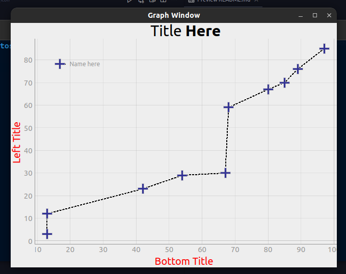

# PyQtGraph

This repository teach you how to build a __PyQtGraph__, and how to insert a style.

__PyQtGraph__ is used in exploratory data science, with pandas and numpy and more.

### Technologies used

* python 3.10.0v
* PyQt6 6.2.3v
* pyqtgraph 0.12.4v

## Author

_Created by: Hugo Rodrigues Pereira_