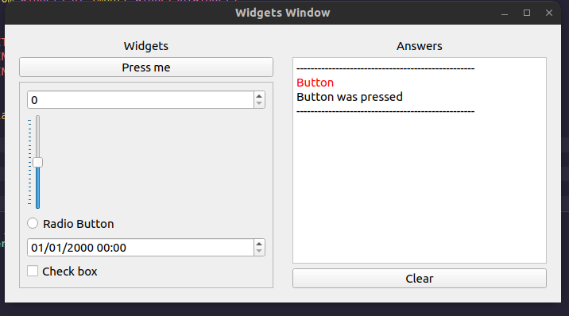

# Widgets 

Widgets of _PyQt6_, the widgets is components of interaction with the user.

### Description

This repository will show you many widgets, and your sinals, like the push button widget, checkbox, radio button and more widgets.

### Technologies used

* python 3.10.0v
* PyQt6 6.2.3v

## Author

_Created by: Hugo Rodrigues Pereira_
