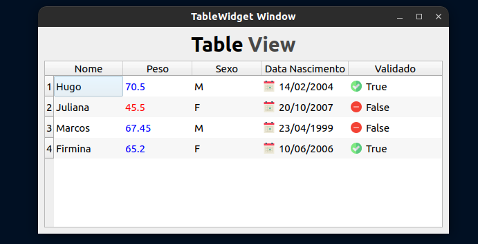

# Table View 

Table View is a widget of _PyQt6_, this repository will abort how to create a table view and insert a table model.

### Description 

A table view is a widget of _PyQt_ framework, has how objectve 
show the user the set of datas out of manipulations.

### Technologies used

* python 3.10.0v
* PyQt6 6.2.3v
* rich 12.0.0v

## Author

_Created by: Hugo Rodrigues Pereira_
